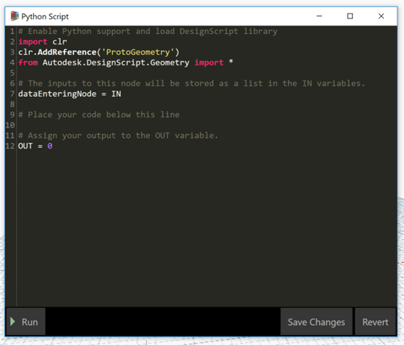

# Python in Dynamo

This section will go through the basics on how to write custom python code within Dynamo.

Dynamo has a powerful feature, similar to other VPL, which is the ability to write custom python code on its own text editor, allowing to perform large methods and logic in a compressed and more performant manner, by being able to load libraries an modules like ProtoGeometry and Revit utilities.

- [Python in Dynamo](#python-in-dynamo)
  - [Key Features](#key-features)
  - [Disadvantages](#disadvantages)

As you can see when opening a new **Python Script** node, it comes with a default template which contains:

- Loaded **ProtoGeometry** module/library, which is the library Dynamo Geometry is based on, allowing to access all constructors and methods as if using nodes on the canvas.
- A `dataEnteringNode` variable mapped to the `IN` internal variable. This variable is a list containing the values connected to the input ports. To access first port you would query `IN[0]`, second `IN[1]`, etc. You can create as many input ports as required.
- An `OUT` variable. This, similar to the `IN` internal variable, is what the python script will exposed on the `OUT` port on the node. output ports can only be one.

Dynamo uses **IronPyton**, a flavour of Python tightly integrated with .NET frameworks.

## Key Features
- Load all modules available on IronPython.
- Can use Dynamo Geometry library to perform expensive computational operations in a single contained environment, reducing graph size and RAM overhead.
- Can easily integrate modules/libraries to interact with the Revit API.
- Can run a python file (`.py`) by loading it from its path in disk.
- Complex loop statements can be easily written to overcome the lack of a VPL.

## Disadvantages
- As is not Python per se, some very useful modules/packages native to Python can not be used in this environment.
- Each Python Script node has its own scope, so classes or methods defined in one cannot be shared across.
- Does not implement any Replication principle, so developer **must** take into account and/or define clearly the expected input.
- It only has one output port, so when returning multiple values, these must be as a list and handle that afterwards.

