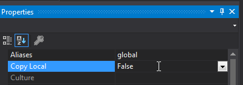
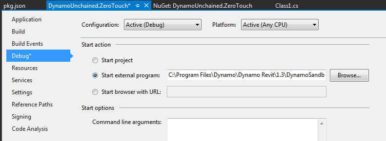

# 3.1 - Visual Studio Setup<!-- omit in toc --> 

We'll be using Visual Studio 2017 as our IDE to create our custom ZeroTouch nodes for Dynamo.

- [Creating New Project](#Creating-New-Project)
- [Dynamo References](#Dynamo-References)
- [Creating a Package](#Creating-a-Package)
- [Deploying to Dynamo Packages Folder](#Deploying-to-Dynamo-Packages-Folder)
    - [Built Events](#Built-Events)
    - [Csproject `AfterBuild` Targets](#Csproject-AfterBuild-Targets)
- [Setting Start Action](#Setting-Start-Action)
- [Hello World!](#Hello-World)
  - [Debugging](#Debugging)
  - [Naming](#Naming)

## Creating New Project

Create a new **Class Library** project on Visual Studio. Be mindful of version of .NET framework the Dynamo version you plan to develop for is using. Dynamo aligns its version to the .NET framework version Revit uses:
- Revit 2017/2018 uses .NET Framework 4.6 (4.6.1 or 4.6.2)
- Revit 2019 uses .NET Framework 4.7


## Dynamo References

To extend Dynamo at a very basic level (eg. manipulating native .NET data types like strings, numbers…) you don’t need to add any references. But if we want interact with Dynamo's geometry types, we need to add a few. We’ll be using NuGet, as it makes referencing super easy and it lets you build your node even without Dynamo.


For now we need `DynamoVisualProgramming.ZeroTouchLibrary` which depends on `DynamoVisualProgramming.DynamoServices` and will be downloaded automatically. Make sure they match your Dynamo version, in our case it's `2.0.1`.


You can see that 4 new dlls have been referenced:


Select them, right click and set *Copy Local* to *False* in the properties:



This will avoid unnecessary files in our package. Also note that Dynamo will not launch or debug properly if these DLLs are present in a package directory.

## Creating a Package

A zero touch node needs to be loaded in Dynamo manually each time or be added as a package. We’ll set it up as a **Local Package**, so that it will automatically load every time Dynamo starts. It will also make our life easier in case we decide to publish it to the official Dynamo Package Manager in the future.

Dynamo packages have the structure as per below:


* The **bin** folder houses .dll files created with C# or Zero-Touch libraries. This includes any external libraries you might need to reference in your code, such as Json.NET, RestSharp etc.

* The **dyf** folder houses any custom nodes, we won’t have any for this package.

* The **extra** folder houses all additional files. These files are likely to be Dynamo Files (.dyn) or any additional files required (.svg, .xls, .jpeg, .sat, etc.)

* The **pkg.json** file is a basic text file defining the package settings. [This can be created by Dynamo](http://dynamoprimer.com/en/10_Packages/10-4_Publishing.html), but we will make one from scratch.

We'll need to manually create this pkg.json file, but we'll automate the folder creation (we just need the _bin_ folder):

* Right Click on the project > Add > New Item…

* Web > JSON File

* Save as pkg.json


Then copy/paste the following package description, which is some boilerplate JSON code, into your newly-created `pkg.json` file :

```json
{
    "license": "",
    "file_hash": null,
    "name": "Dynamo Workshop - ZeroTouch",
    "version": "1.0.0",
    "description": "ZeroTouch sample node for the Dynamo workshop",
    "group": "",
    "keywords": null,
    "dependencies": [],
    "contents": "",
    "engine_version": "2.0.2.6986",
    "engine": "dynamo",
    "engine_metadata": "",
    "site_url": "",
    "repository_url": "",
    "contains_binaries": true,
    "node_libraries": [
        "DynamoWorkshop.ZeroTouch, Version=1.0.0.0, Culture=neutral, PublicKeyToken=null"
    ]
}
```

## Deploying to Dynamo Packages Folder

When downloading and/or installing a Dynamo packages, they need to be located on `C:\Users\{USER}\AppData\Roaming\Dynamo\Dynamo {TARGET}\{VERSION}\packages`, where:
- `USER` is your PC's user folder.
- `TARGET` is `Core` and/or `Revit`, depending on to which platform you are targeting.
- `VERSION` the Dynamo version you are building for.

When creating your own package, is helpful to set an action to copy the appropriate folder structure and files to these locations to be able to debug.

This can be achieved by two ways

#### Built Events

Right click on the project > `Properties` > `Build Events` > `Post-build event command line` > paste the two following lines:

```
xcopy /Y "$(TargetDir)*.*" "$(AppData)\Dynamo\Dynamo Core\2.0\packages\$(ProjectName)\bin\"

xcopy /Y "$(ProjectDir)pkg.json" "$(AppData)\Dynamo\Dynamo Core\2.0\packages\$(ProjectName)"
```

These lines tell VisualStudio to copy into the package folder the `dlls` produced in the bin folder and the `pkg.json`.

#### Csproject `AfterBuild` Targets

Modifying hte `.csproject` XML file, we can add a set of actions to be performed after the project has been compiled.

```xml
...
<Target Name="AfterBuild">
    <ItemGroup>
      <Dlls Include="$(OutDir)*.dll" />
      <Pdbs Include="$(OutDir)*.pdb" />
      <Xmls Include="$(OutDir)*.xml" />
      <Configs Include="$(OutDir)*.config" />
      <PkgJson Include="$(ProjectDir)manifest/*pkg.json" />
      <SourcePackage Include="$(SolutionDir)dist\$(PackageName)\**\*" />
    </ItemGroup>
    <PropertyGroup>
      <PackageName>MyPackage</PackageName>
    </PropertyGroup>
    <!-- This copies every file to a dist folder on the solutions directory -->
    <Copy SourceFiles="@(Dlls)" DestinationFolder="$(SolutionDir)dist\$(PackageName)\bin\" />
    <Copy SourceFiles="@(Pdbs)" DestinationFolder="$(SolutionDir)dist\$(PackageName)\bin\" />
    <Copy SourceFiles="@(Xmls)" DestinationFolder="$(SolutionDir)dist\$(PackageName)\bin\" />
    <Copy SourceFiles="@(Configs)" DestinationFolder="$(SolutionDir)dist\$(PackageName)\bin\" />
    <Copy SourceFiles="@(PkgJson)" DestinationFolder="$(SolutionDir)dist\$(PackageName)" />
    <MakeDir Directories="$(SolutionDir)dist\$(PackageName)\dyf" />
    <MakeDir Directories="$(SolutionDir)dist\$(PackageName)\extra" />

    <!-- This copies the distributed package on dist folder to the Dynamo Packages folder. -->
    <Copy SourceFiles="@(SourcePackage)" DestinationFolder="$(AppData)\Dynamo\Dynamo Core\2.0\packages\$(PackageName)\%(RecursiveDir)" />
  </Target>
...
```

> **Note:**
> The commands above point to the current version of Dynamo Sandbox, if you’re using a different version update accordingly.


## Setting Start Action

To tell VS to open Dynamo when debugging, we need to set up the `Start Action` to point to Dynamo's exe file:

`C:\Program Files\Dynamo\Dynamo Core\2\DynamoSandbox.exe`




## Hello World!

It still looks a bit empty in here, let’s add some dummy code so that we can check everything is set up correctly. Add a new class named HelloDynamo.cs, or rename Class1.cs:

```csharp
namespace DynamoWorkshop.ZeroTouch
{
  public static class HelloDynamo
  {
    public static string SayHello(string Name)
    {
      return "Hello " + Name + "!";
    }
  }
}
```
### Debugging

Press F5 or click the green play button to start debugging, Dynamo Sandbox should start automatically. Create a new file, and you should see our new package being loaded & appearing in the library :


Now, if you put some breakpoints in VS you’ll be able to get great insights into what’s going on in your code, which will help you fix bugs quicker and improve your dev skills too!

Since we set up our package as a local package, we can actually see it in the list of installed packages:


#### Note<!-- omit in toc --> 
>Before going ahead to debug our code, we need to change a VS setting. This is not required by Dynamo, but Revit instead, we'll do it now for peace of mind.  Go under *Tools > Options... > Debugging > General > Check "Use Managed Compatibility Mode"*. If Managed Compatibility Mode is unchecked and you try debugging within Revit it will crash during startup.


### Naming

One last thing, annoyingly enough, Dynamo didn’t format the Node Name very well. Our node was nested inside `DynamoWorkshop` > `ZeroTouch` > `DynamoWorkshop` > `ZeroTouch`.

The first two are taken from the assembly name (the DLL), the last two from the namespace, which in our case are the same.

To  avoid this you can either do the following 2 things:

* change assembly name (and change the corresponding value in pkg.json)

* add a *DynamoWorkshop.ZeroTouch_DynamoCustomization.xml* file

I prefer to keep my assembly names unchanged, so let’s add the XML file to the root of our project, then **remember to select it in VisualStudio and set its *Build Action* to _Copy always_****.**

```xml
<?xml version="1.0"?>
<doc>
  <assembly>
    <name>DynamoWorkshop.ZeroTouch</name>
  </assembly>
  <namespaces>
    <namespace name="DynamoWorkshop.ZeroTouch">
      <category>DynamoWorkshop.ZeroTouch</category>
    </namespace>
  </namespaces>
</doc>
```
Debug again, and it'll be much better now:


We’ve now finally set up our project correctly, you can save the project and use it in the future as a template.