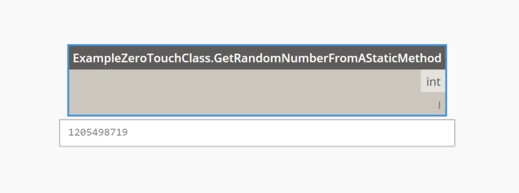
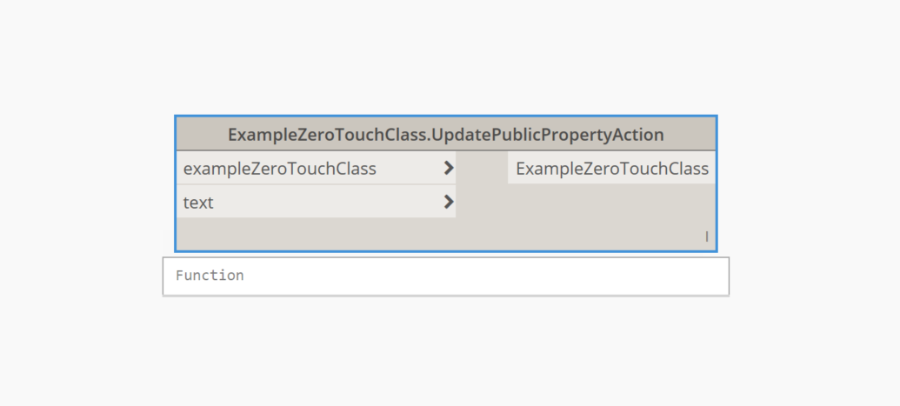

# 2 - ZeroTouch mapping<!-- omit in toc --> 

As mentioned before, Dynamo will automatically map `public` properties and methods to nodes, so let's see a more applied example of this.

Open up the example solution and you should see this


- [Properties](#properties)
  - [Methods](#methods)
- [Static constructors](#static-constructors)

## Properties
Let's look at how properties get mapped to nodes.

```c#
// This property is public and hence visible in Dynamo as a node.
// This displays in Dynamo as a Query node, identified with a blue ? icon.
public string ZeroTouchPublicProperty { get; set; }

// This property will not be visible in Dynamo because it is not public.
static string ZeroTouchPrivateProperty { get; set; }
```

### Methods
Methods all get mapped to nodes, as long they are `public`, whether `static` or not.

Static methods are straight-forward :
```c#
// This public static method returns a random number every time it's executed.
// Notice how the node Dynamo creates does not require an instance of an ExampleZeroTouchClass as input.
public static int GetRandomNumberFromAStaticMethod()
{
  return new Random().Next();
}
```
results in this node


Non-static methods are also turned into node. Let's see an example :
```c#
public ExampleZeroTouchClass UpdatePublicPropertyAction(string text)
{
  this.ZeroTouchPublicProperty = text;
  return this;
}
```
Because this method is not static, notice how Dynamo adds another input to the resulting node, asking for an instance of ExampleZeroTouchClass :


## Static constructors
Methods that return the same type as the the class they belong to are treated differently if they are also `static`, being rendered as constructor nodes.

Let's see an example method :
```c#
// This static method will return a new instance of the ExampleZeroTouchClass, with the ZeroTouchPublicProperty set to the text provided.
// This displays in Dynamo as a Constructor node, identified with a green + icon.
public static ExampleZeroTouchClass ByUserTextConstructor(string text)
{
  var newInstance = new ExampleZeroTouchClass();
  newInstance.ZeroTouchPublicProperty = text;
  return newInstance;
}
```
In Dynamo, this will look like this :


Let's visualise all these mappings from C# code to nodes to understand the direct relationship :
