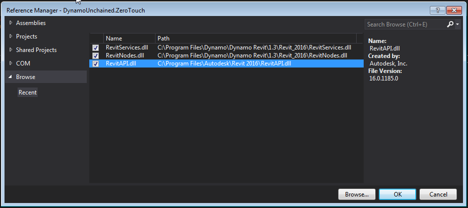
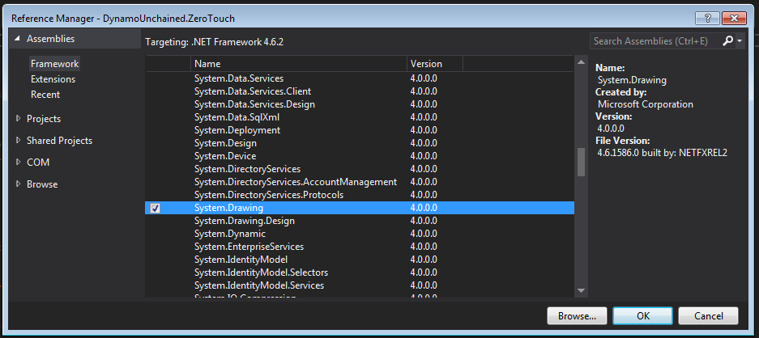

# 3.4 - Revit Node Development<!-- omit in toc --> 

Everything covered so far will run smoothly in Dynamo Sandbox and it's great to use it to get started developing nodes, but soon enough you'll want to be interacting with Revit elements too. A great feature of zero touch nodes is that they'll let you use the Revit and Dynamo API at the same time! This might be a bit confusing at first, but we'll see soon how to do that and the [revitapidocs](http://www.revitapidocs.com/) website is great to get familiar with the Revit API. 

The Revit elements you access inside of Dynamo are not the native ones, but are *wrappers* around them, we'll also see more in detail what this means.

- [References](#references)
- [Code Example 1 - GetWallBaseline](#code-example-1---getwallbaseline)
- [Wrapping, Unwrapping and Converting](#wrapping-unwrapping-and-converting)
  - [From Revit to Dynamo](#from-revit-to-dynamo)
  - [From Dynamo to Revit](#from-dynamo-to-revit)
- [Code Example 2 - TextToWalls](#code-example-2---texttowalls)

## References

We need to add 3 more references manually, as these don't come as NuGet packages.

In your VisualStudio project, right click on `References` > `Add Reference` > `Browse`...


Browse and add the following DLLs, the first to the Revit API:

`C:\Program Files\Autodesk\Revit 2019\RevitAPI.dll`

Then to the Dynamo Revit Nodes and Services

`C:\Program Files\Dynamo\Dynamo Revit\2.0\Revit_2018\RevitNodes.dll`

`C:\Program Files\Dynamo\Dynamo Revit\2.0\Revit_2018\RevitServices.dll`

Again, remember to select these newly added references and to set *Copy Local* to *False*.



As mentioned earlier, since now we'll be building and debugging for Revit, you now need to update your [start action and build events](#Start-Action-and-Build-Events).

> **Note:**
> The Revit API libraries (dlls) are guaranteed to be valid for use only with the version of Revit they came with. This means that if you reference the `RevitAPI.dll` file from your Revit 2019 installation, your nodes will work with Revit 2019, might work with later versions (2019, etc) and will probably not work with older versions (2017). Targeting multiple versions of Revit is doable however, see [Konrad's excellent tutorial](http://archi-lab.net/how-to-maintain-revit-plug-ins-for-multiple-versions/) for more information.

## Code Example 1 - GetWallBaseline

In this example, we'll write a node that takes in a Revit wall and outputs its baseline as a Dynamo curve.

Let's create a new `public static class` named `HelloRevit`. We will need to add the following directives corresponding to the new references:

```c#
using Autodesk.Revit.DB;
using Revit.Elements;
using RevitServices.Persistence;
```
If now you create a new method that uses the `Wall` object, for instance, you'll see the following error:


Visual Studio, isn't sure if we mean a native Revit wall or a Dynamo wall. We can fix that by typing the full namespace as:


Let's now explore how we can write a node that takes in some Walls and outputs their baseline curves. Write a new function:

```c#
public static Autodesk.DesignScript.Geometry.Curve GetWallBaseline(Revit.Elements.Wall wall)
{
  //get Revit Wall element from the Dynamo-wrapped object
  var revitWall = wall.InternalElement;
  //get the location curve of the wall using the Revit API
  var locationCurve =  revitWall.Location as LocationCurve;
  //convert the curve to Dynamo and return it
  return locationCurve.Curve.ToProtoType();
}
```
This isn't too exciting, but hey, you wrote your first ZTN for Revit! The code also shows us how to *unwrap* a Dynamo wall to get the native Revit one, and how to *convert* a Revit curve into a Dynamo one, a fundamental part of zero touch nodes.

## Wrapping, Unwrapping and Converting

The following lists show some of the most common extension methods that you might need, they take care of conversion of Revit elements and geometry to Dynamo ones and vice-versa.

You can find these extension methods in the `RevitNodes.dll` assembly that comes with every Dynamo installation. Again, this will be versioned due to Revit's API, so look for it in the folder below, adjusting for your version of Revit & Dynamo :
`C:\Program Files\Dynamo\Dynamo Revit\2.0\Revit_2018\RevitNodes.dll`

### From Revit to Dynamo

```c#
//Elements
Element.ToDSType(bool); //true if it's an element generated by Revit
//Geometry
XYZ.ToPoint() > Point
XYZ.ToVector() > Vector
Point.ToProtoType() > Point
List<XYZ>.ToPoints() > List<Point>
UV.ToProtoType() > UV
Curve.ToProtoType() > Curve
CurveArray.ToProtoType() > PolyCurve
PolyLine.ToProtoType() > PolyCurve
Plane.ToPlane() > Plane
Solid.ToProtoType() > Solid
Mesh.ToProtoType() > Mesh
IEnumerable<Mesh>.ToProtoType() > Mesh[]
Face.ToProtoType() > IEnumerable<Surface>
Transform.ToCoordinateSystem() > CoordinateSystem
BoundingBoxXYZ.ToProtoType() > BoundingBox
```
### From Dynamo to Revit

```c#
//Elements
Element.InternalElement
//Geometry
Point.ToRevitType() > XYZ
Vector.ToRevitType() > XYZ
Plane.ToPlane() > Plane
List<Point>.ToXyzs() > List<XYZ>
Curve.ToRevitType() > Curve
PolyCurve.ToRevitType() > CurveLoop
Surface.ToRevitType() > IList<GeometryObject>
Solid.ToRevitType() > IList<GeometryObject>
Mesh.ToRevitType() > IList<GeometryObject>
CoordinateSystem.ToTransform() > Transform
CoordinateSystem.ToRevitBoundingBox() > BoundingBoxXYZ
BoundingBox.ToRevitType() > BoundingBoxXYZ
```


## Code Example 2 - TextToWalls

We're now going to do something more complex, we will write a custom node that takes in a string, converts the text shape into lines and uses those lines to place walls.

Create a new `TextUtils` class as below:

```c#
using System.Collections.Generic;
using System.Linq;
using Autodesk.DesignScript.Runtime;
using Autodesk.DesignScript.Geometry;
using System.Drawing;
using System.Drawing.Drawing2D;

namespace DynamoWorkshop.ZeroTouch
{
  public static class TextUtils
  {
    /// <summary>
    /// Converts a string into a list of segments
    /// </summary>
    /// <param name="text">String to convert</param>
    /// <param name="size">Text size</param>
    /// <returns></returns>
    [IsVisibleInDynamoLibrary(false)] // this attribute will prevent this method from showing up in Dynamo as a node
    public static IEnumerable<Line> TextToLines(string text, int size)
    {
      List<Line> lines = new List<Line>();

      //using System.Drawing for the conversion to font points
      using (Font font = new System.Drawing.Font("Arial", size, FontStyle.Regular))
      using (GraphicsPath gp = new GraphicsPath())
      using (StringFormat sf = new StringFormat())
      {
        sf.Alignment = StringAlignment.Center;
        sf.LineAlignment = StringAlignment.Center;

        gp.AddString(text, font.FontFamily, (int)font.Style, font.Size, new PointF(0, 0), sf);

        //convert font points to Dynamo points
        var points = gp.PathPoints.Select(p => Autodesk.DesignScript.Geometry.Point.ByCoordinates(p.X, -p.Y, 0)).ToList();
        var types = gp.PathTypes;

        Autodesk.DesignScript.Geometry.Point start = null;
        //create lines
        for (var i = 0; i < types.Count(); i++)
        {
          //Types:
          //0 start of a shape
          //1 point in line
          //3 point in curve
          //129 partial line end
          //131 partial curve end
          //161 end of line
          //163 end of curve
          if (types[i] == 0)
          {
            start = points[i];
          }
          //some letters need to be closed other no
          if (types[i] > 100)
          {
            if (!points[i].IsAlmostEqualTo(start))
            {
              lines.Add(Line.ByStartPointEndPoint(points[i], start));
            }
          }
          else
          {
            lines.Add(Line.ByStartPointEndPoint(points[i], points[i + 1]));
          }
        }
        //dispose points
        foreach (var point in points)
        {
          point.Dispose();
        }
        return lines;
      }
    }
  }
}
```
We don't need to get into detail, this class simply converts a string text into lines, note the `[IsVisibleInDynamoLibrary(false)]` attribute that prevents it from showing up in Dynamo. For it to work you need to add a reference to `System.Drawing` in References > Add Reference... > Assemblies > Framework.



Now we need to add a few more things to our class.

First, we add a `Document` member, which uses the Revit API to get a reference to the currently open document (`.rvt` file) inside Revit. Remember, collecting & creating elements always happens in the context of a Revit document.
```c#
internal static Autodesk.Revit.DB.Document Document
{
  get { return DocumentManager.Instance.CurrentDBDocument; }
}
```

Now add a new `SayHello` method to the `HelloRevit` class, which will take a string, a wall height, a level, a wall type and an optional font size.
```c#
public static IEnumerable<Revit.Elements.Wall> SayHello(string text, double height, Revit.Elements.Level level, Revit.Elements.WallType wallType, int fontSize = 25)
{

}
```

Before proceeding we need to make sure some of these input arguments are valid:

```c#
  if (level == null)
  {
    throw new ArgumentNullException("level");
  }

  if (wallType == null)
  {
    throw new ArgumentNullException("wallType");
  }
```
Then we can call our utility method to generate the lines from the text with:

```c#
var lines = TextUtils.TextToLines(text, fontSize);
```

Now, you'd be very tempted to write something like the loop below, using the Dynamo API for generating new walls, but beware! Because of an intrinsic mechanism called *element binding* (that can't be turned off), the loop would only return a single element.  The right way to loop and generate multiple elements is using the Revit API.

Dynamo API (wrong method):

```c#
  var walls = new List<Revit.Elements.Wall>();
  foreach (var curve in lines)
  {      
      walls.Add(Revit.Elements.Wall.ByCurveAndHeight(curve, height, level, wallType));
  }
```
Revit API (right method):

```c#
  var walls = new List<Revit.Elements.Wall>();
  //elements creation and modification has to be inside of a transaction
  TransactionManager.Instance.EnsureInTransaction(Document);
  foreach (var curve in lines)
  {
    // use the Revit Wall.Create API to make a new wall element
      var wall = Autodesk.Revit.DB.Wall.Create(
        Document, // note the required reference to the Revid Document
        curve.ToRevitType(), // also note we need to convert Dynamo curves to Revit types
        wallType.InternalElement.Id, // Revit elements returned from Dynamo are wrapped, so we need to access the internal element directly
        level.InternalElement.Id, 
        height, 
        0.0, 
        false, 
        false);
      walls.Add(wall.ToDSType(false) as Revit.Elements.Wall); // notice we need to wrap Revit elements back so they can be used in Dynamo
  }
```
Whenever you are using the Revit API to create or modify elements, these methods need to be wrapped inside a transaction. This is handled automatically when calling Dynamo methods.

After this, the last code example is complete, you can now debug the project and see the node in action, mind to use the right units for *height* and *size*, as in my case where the project is in meters:

